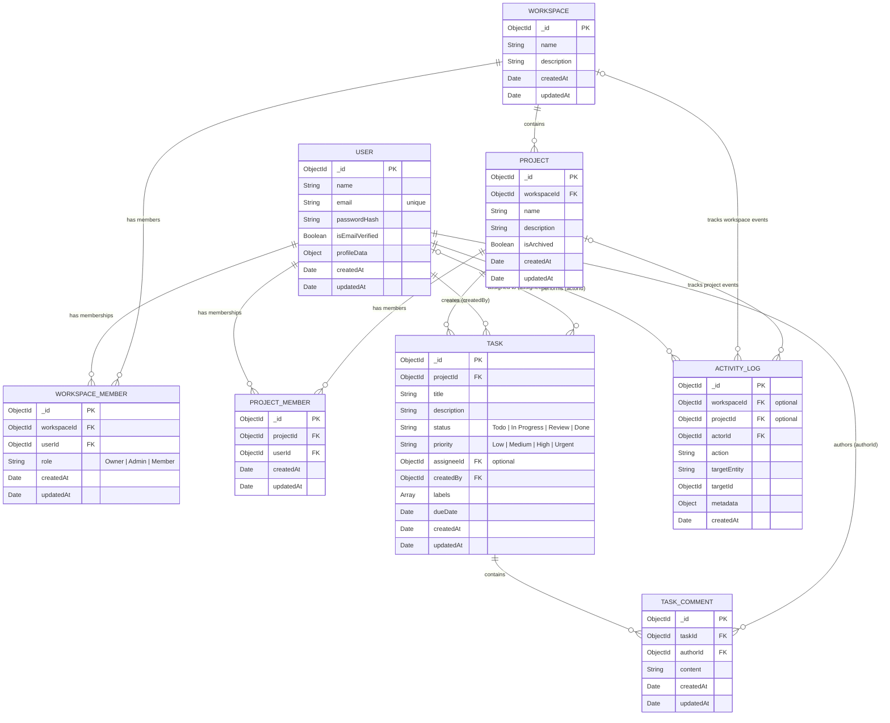

# Entity-Relationship Diagram
# SyncForge

**Version:** 1.0

## 1. Data Model Diagram
This diagram illustrates the core collections, relationships, and essential fields for the SyncForge MVP. It is strictly based on the approved Database Design structure.

## 2. Relationship Notes

### Workspace Memberships (User ↔ Workspace)
- **Implementation:** Resolved via the dedicated `WORKSPACE_MEMBER` collection rather than an embedded array (to ensure high scalability).
- **Access Boundary:** A user must possess an active `WORKSPACE_MEMBER` record to access the workspace. The `role` (Owner, Admin, or Member) on this record determines their high-level permissions.

### Project Memberships (User ↔ Project)
- **Implementation:** Resolved via the dedicated `PROJECT_MEMBER` collection.
- **Access Boundary:** Project authorization (access to tasks/comments) explicitly requires `PROJECT_MEMBER` presence, even for Workspace Owners and Admins.
- **Roles:** Project-specific roles do not exist; standard authorization bubbles down from the workspace level. A user must be an active workspace member before being added as a project member.

### Task Ownership & Assignment
- **Creation:** A task must always have a valid `createdBy` reference pointing to the user who initially created the task.
- **Assignment:** The `assigneeId` is optional (0..1 relationship from Task to User). A task does not require an assignee, but can be assigned to a valid project member.

### Activity Tracking
- **Loose Coupling:** The `ACTIVITY_LOG` collection acts as an append-only audit trail.
- **References:** An activity is strictly tied to an `actorId` (the user performing the action), but links to `workspaceId` and `projectId` are optional depending on the scope of the event (e.g., adding a workspace member only requires a workspace reference, whereas updating a task status requires both).
- **Flexibility:** `targetEntity` and `targetId` dynamically point to the entity that was acted upon (e.g., a specific Task or Project ID).

---
**End of ER Diagram Document**
